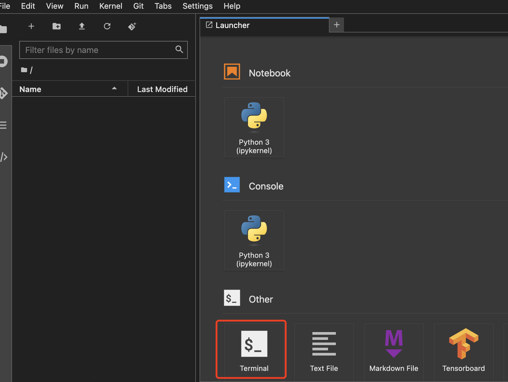
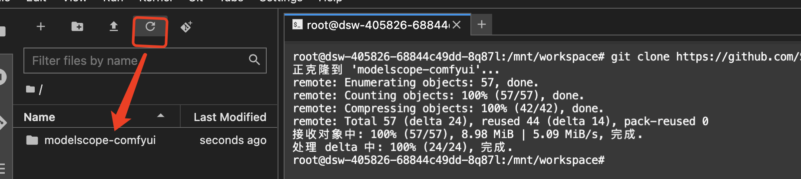
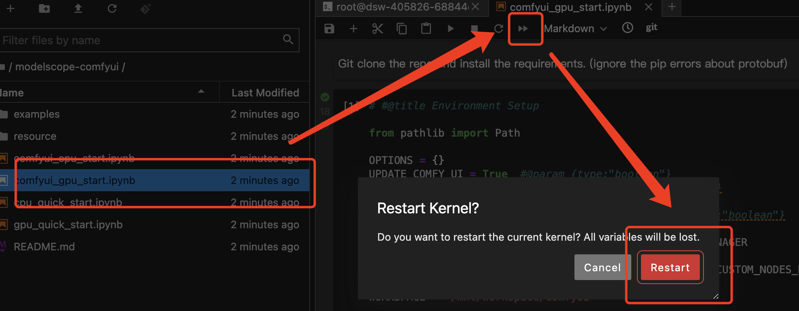
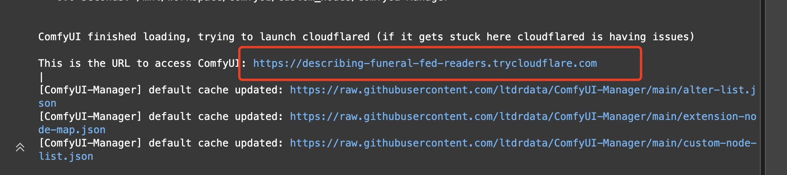

# modelscope-comfyui

- 这个项目主要记录在[魔搭社区](https://www.modelscope.cn/)使用 comfyui 时，一键部署环境，下载资源的一些工作流启动文件

- 也欢迎有能力的小伙伴给我分享点好玩的工作流一键启动文件

## 视频教程

- [一键启动文生图，图生视频](https://www.bilibili.com/video/BV1YCLGeBEpo/?vd_source=25538f327d9fbb263586d70d99356b17)

## 启动

究极白嫖教程，一行代码启动 AI 生成图片视频，用脚都行，无需本地配置不用下载

1. 打开魔搭的 Notebook 后，首先打开命令行工具，复制下面命令拉取项目
   

```bash
git clone https://github.com/SoonerOrLater-NewBest/modelscope-comfyui.git
```

2. 项目下载好后，点刷新就可以看到文件夹，然后双击进去
   

3. 根据选择的模式和想要的工作流，选择对应的 cpu 或 gpu 文件一键部署启动



4. 代码执行完，看到下图链接，点击打开
   

5. 然后就可以开始玩了

## 后续

- 继续添加其他好玩的工作流
